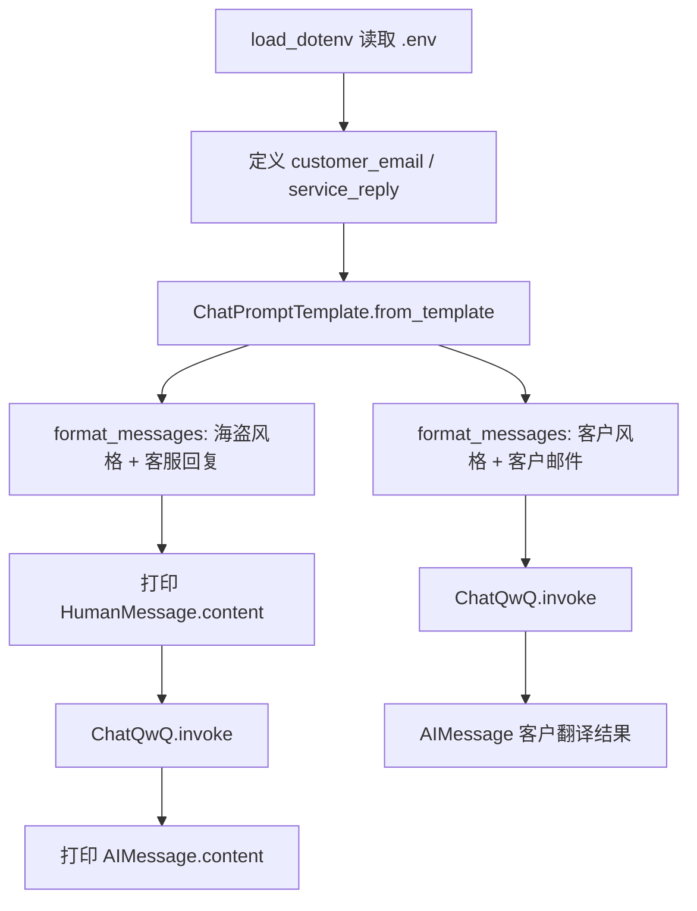

# 使用 LangChain 完成风格化文本翻译

## 2. 本节学习目标

- 理解 Chat Model（聊天模型）的基本调用方式：`invoke` 与消息列表
- 理解 `ChatPromptTemplate` 如何参数化构建提示词
- 掌握 `format_messages` 将模板变量填充为 `BaseMessage` 列表
- 理解「客户邮件翻译」与「客服回复翻译」两次调用的完整数据流
- 能将直接 SDK 调用与 LangChain 抽象进行对比，判断何时需要框架

## 3. 项目功能概述

### 实现了什么

本脚本演示 LangChain 最基础的组合：**Prompt 模板 + Chat 模型**。它把两段英文文本（客户投诉邮件、客服回复）分别按不同「风格」指令发给大模型，让模型输出改写后的文本。

### 输入与输出

| 步骤 | 输入 | 输出 |
|------|------|------|
| 第一次调用 | 海盗风格客户邮件 + 风格描述「美式英语、平静尊重」 | 模型改写后的客户邮件 |
| 第二次调用 | 客服原文 + 风格描述「礼貌的海盗英语」 | 模型改写后的客服回复（打印到终端） |

### 关键组件

- `python-dotenv`：加载 `.env` 中的 API 配置
- `ChatQwQ`：通义千问（百炼兼容模式）聊天模型封装
- `ChatPromptTemplate`：可复用的聊天提示词模板

### 业务场景

- 多语言 / 多风格客服文案改写
- 品牌语气统一（Tone of Voice）
- 用户生成内容（UGC）清洗与规范化
- 学习 LangChain 前的「最小可运行示例」

> **说明**：文件名含 `parsers`，但当前代码**尚未使用 OutputParser**；输出解析会在后续课程（如 `02-llm生成json.py`）展开。

## 4. 前置知识

- Python 字符串、三引号多行字符串
- 函数调用与关键字参数
- 环境变量概念
- HTTP API / API Key 基本认知
- （可选）前端模板字符串 `` `Hello ${name}` `` 的概念

## 5. 环境与依赖

### 安装

```bash
cd AIPython
make install
# 或
pip install langchain langchain-core langchain-qwq python-dotenv
```

### 依赖说明

| 包 | 作用 |
|----|------|
| `langchain-core` | 提供 `ChatPromptTemplate`、消息类型等核心抽象 |
| `langchain-qwq` | 百炼 / 通义 `ChatQwQ` 模型封装 |
| `python-dotenv` | 从 `.env` 加载 `DASHSCOPE_API_KEY` 等 |

### 推荐环境

- Python **3.10+**（项目 `pyproject.toml` 要求）
- macOS arm64 原生终端（M 芯片避免 Rosetta 架构冲突）
- LangChain **1.x** + `langchain-core` 1.4+

### `.env` 示例

```env
DASHSCOPE_API_KEY=sk-your-key-here
DASHSCOPE_API_BASE=https://dashscope.aliyuncs.com/compatible-mode/v1
```

不要把 API Key 写进代码：避免泄露到 Git、截图或日志。

### 运行方式

```bash
./run.sh lessons/03-langchain/01-model\&prompts\&parsers.py
```

## 6. 完整代码

```python
import os
from openai import OpenAI
from dotenv import load_dotenv, find_dotenv
from langchain_qwq import ChatQwQ
from langchain_core.prompts import ChatPromptTemplate

_ = load_dotenv(find_dotenv())  # 从 .env 读取 API Key 等配置

temperature = 0

customer_email = """
    Arrr, I be fuming that me blender lid \
    flew off and splattered me kitchen walls \
    with smoothie! And to make matters worse,\
    the warranty don't cover the cost of \
    cleaning up me kitchen. I need yer help \
    right now, matey!
"""

template_string = """Translate the text \
that is delimited by triple backticks \
into a style that is {style}. \
text: ```{customer_email}```
"""

prompt_template = ChatPromptTemplate.from_template(template_string)

customer_style = """American English \
in a calm and respectful tone
"""

customer_messages = prompt_template.format_messages(
    style=customer_style, customer_email=customer_email
)

model = ChatQwQ(model="qwen3.7-plus", temperature=temperature)
response = model.invoke(customer_messages)

service_reply = """Hey there customer, \
the warranty does not cover \
cleaning expenses for your kitchen \
because it's your fault that \
you misused your blender \
by forgetting to put the lid on before \
starting the blender. \
Tough luck! See ya!
"""

service_style_pirate = """\
a polite tone \
that speaks in English Pirate\
"""

service_messages = prompt_template.format_messages(
    style=service_style_pirate,
    customer_email=service_reply)

print(service_messages[0].content)
service_response = model.invoke(service_messages)
print(service_response.content)
```

## 7. 代码执行流程

### 自然语言概括

1. 加载 `.env`，读取百炼 API Key
2. 定义客户邮件原文、客服回复原文
3. 创建带 `{style}`、`{customer_email}` 占位符的翻译模板
4. **第一次**：填入「平静美式英语」风格 + 客户邮件 → `format_messages` → `model.invoke` → 得到改写结果（代码中未打印）
5. **第二次**：填入「礼貌海盗英语」风格 + 客服回复 → 打印完整 prompt → `model.invoke` → 打印模型输出

### 流程图



## 8. 逐段代码讲解

### 8.1 导入依赖

```python
from dotenv import load_dotenv, find_dotenv
from langchain_qwq import ChatQwQ
from langchain_core.prompts import ChatPromptTemplate
```

**作用**：引入环境配置、聊天模型、提示词模板。

**LangChain 知识点**：`langchain_core` 是 LangChain 1.x 的核心层，与具体模型厂商解耦；`langchain_qwq` 是社区/扩展包，提供百炼模型适配。

**常见误区**：`import os` 与 `from openai import OpenAI` 在本文件中**未使用**，属于冗余导入。

**前端类比**：`ChatPromptTemplate` 类似带插值变量的 React 组件 props 模板；`ChatQwQ` 类似封装了鉴权与请求格式的 API Client。

### 8.2 加载环境变量

```python
_ = load_dotenv(find_dotenv())
temperature = 0
```

**执行时**：`find_dotenv()` 向上查找 `.env`；`load_dotenv` 将键值注入 `os.environ`。`ChatQwQ` 会读取 `DASHSCOPE_API_KEY` 和 `DASHSCOPE_API_BASE`。

`temperature=0` 表示低随机性，输出更稳定，适合翻译类任务。

### 8.3 定义模板与变量

```python
template_string = """Translate the text ... {style}. text: ```{customer_email}```"""
prompt_template = ChatPromptTemplate.from_template(template_string)
```

**执行时**：`from_template` 解析 `{style}`、`{customer_email}` 为输入变量，默认生成含一条 `HumanMessage` 的模板。

**常见误区**：占位符名 `{customer_email}` 在第二次调用时实际填入的是 `service_reply`，命名易误导，但不影响运行。

### 8.4 format_messages

```python
customer_messages = prompt_template.format_messages(
    style=customer_style, customer_email=customer_email
)
```

**输出**：`list[BaseMessage]`，通常为 `[HumanMessage(content="Translate the text...")]`

**与 `format` 区别**：`format_messages` 直接产出消息对象，供 Chat Model 使用；`format` 产出字符串。

### 8.5 model.invoke

```python
model = ChatQwQ(model="qwen3.7-plus", temperature=temperature)
response = model.invoke(customer_messages)
```

**执行时**：LangChain 将消息序列化为百炼兼容 API 请求 → HTTP 调用 → 返回 `AIMessage`，正文在 `response.content`。

## 9. 核心 LangChain 组件说明

| 组件 | 所属模块 | 主要职责 | 输入 | 输出 | 当前职责 |
|------|----------|----------|------|------|----------|
| `ChatPromptTemplate` | `langchain_core.prompts` | 参数化消息模板 | `dict`（style, customer_email） | `list[BaseMessage]` | 生成翻译指令 |
| `ChatQwQ` | `langchain_qwq` | 调用通义聊天 API | `list[BaseMessage]` | `AIMessage` | 执行翻译 |
| `load_dotenv` | `python-dotenv` | 加载环境变量 | `.env` 文件路径 | 无（副作用） | 配置 API Key |

**可替换方案**：`ChatQwQ` 可换为 `ChatOpenAI`、`ChatOllama` 等，只要实现 `BaseChatModel` 接口，`invoke` 调用方式一致。

## 10. 数据在链路中的变化

```text
{"style": "...", "customer_email": "..."}
        ↓
ChatPromptTemplate.format_messages()
        ↓
[List[BaseMessage]]  例如 [HumanMessage(content="Translate...")]
        ↓
ChatQwQ.invoke()
        ↓
AIMessage(content="翻译后的文本...")
        ↓
response.content  →  str
```

本示例**未使用 LCEL**（`prompt | model`），而是手动分步调用。两步复用同一 `prompt_template`，体现模板可复用性。

## 11. 关键对象和方法

### `ChatPromptTemplate.from_template(template: str)`

- **用途**：从字符串快速创建模板
- **返回**：`ChatPromptTemplate` 实例
- **同步**：是

### `format_messages(**kwargs)`

- **用途**：填充变量并返回消息列表
- **参数**：与模板占位符同名的关键字参数
- **返回**：`list[BaseMessage]`

### `ChatQwQ.invoke(input)`

- **用途**：同步调用模型
- **参数**：消息列表或 `PromptValue`
- **返回**：`AIMessage`
- **相关方法**：`ainvoke`（异步）、`stream`（流式）、`batch`（批量）

## 12. LangChain 底层原理

| 工作 | 谁完成 |
|------|--------|
| 字符串 `{style}` 替换 | LangChain `ChatPromptTemplate` |
| 组装 HumanMessage | LangChain |
| 构造 HTTP 请求体、鉴权 Header | `langchain_qwq` / OpenAI 兼容客户端 |
| 文本理解与翻译 | 大模型（qwen3.7-plus） |
| 打印输出 | Python `print` |

LangChain 的价值在本例中主要体现在：**统一的消息格式**与**可复用模板**，而非复杂编排。

## 13. 不使用 LangChain 如何实现

```python
from openai import OpenAI
import os

client = OpenAI(
    api_key=os.environ["DASHSCOPE_API_KEY"],
    base_url=os.environ["DASHSCOPE_API_BASE"],
)

prompt = f"Translate into American English in a calm tone:\n```\n{customer_email}\n```"
resp = client.chat.completions.create(
    model="qwen-plus",
    messages=[{"role": "user", "content": prompt}],
    temperature=0,
)
print(resp.choices[0].message.content)
```

| 对比项 | 直接 SDK | 使用 LangChain |
|--------|----------|----------------|
| 代码复杂度 | 低（单次调用） | 略高 |
| 可组合性 | 需手写拼接 | 模板 + LCEL 可组合 |
| 模型切换 | 改 client 与消息格式 | 换 `ChatXxx` 类即可 |
| 工具调用 / Agent | 自行实现 | 有成熟抽象 |
| 调试追踪 | 自行打日志 | 可接 LangSmith |

**结论**：本例场景简单，SDK 足够；学习 LangChain 是为了后续 Chain、RAG、Agent 等组合场景。

## 14. 相关知识衍生

### Chat Model vs 传统 LLM

Chat Model 接收**消息列表**（多轮对话结构），传统 LLM 接口常接收单一字符串。现代 API 多为 Chat 格式。

### Message 类型

- `SystemMessage`：系统指令
- `HumanMessage`：用户输入
- `AIMessage`：模型回复

本模板默认只生成 `HumanMessage`；可在模板中显式加入 `SystemMessage`。

### 与 LCEL 的关系

等价现代写法：

```python
chain = prompt_template | model
result = chain.invoke({"style": customer_style, "customer_email": customer_email})
```

### OutputParser（本文件未涉及）

`StrOutputParser`、`PydanticOutputParser` 用于把 `AIMessage` 转为字符串或结构化对象，见 `02-llm生成json.py`。

## 15. 当前代码的问题和优化建议

| 问题 | 影响 | 优化方案 | 优先级 |
|------|------|----------|--------|
| 未使用的 `import os`、`OpenAI` | 干扰阅读 | 删除 | 中 |
| 第一次 `response` 未打印 | 看不到完整演示效果 | 增加 `print(response.content)` | 低 |
| 占位符名 `customer_email` 复用于客服文本 | 易混淆 | 改为 `text` 或 `source_text` | 中 |
| 无异常处理 | API 失败时栈追踪不友好 | `try/except` 捕获网络/鉴权错误 | 中 |
| 硬编码 `qwen3.7-plus` | 换模型需改代码 | 环境变量 `MODEL_NAME` | 低 |
| 未使用 LCEL | 与后续课程风格不一致 | 可改为 `prompt \| model` | 低 |

## 16. 优化后的完整代码

```python
"""风格化文本翻译示例：ChatPromptTemplate + ChatQwQ。"""

import os
import sys

from dotenv import load_dotenv, find_dotenv
from langchain_core.prompts import ChatPromptTemplate
from langchain_qwq import ChatQwQ

_ = load_dotenv(find_dotenv())

MODEL_NAME = os.getenv("CHAT_MODEL", "qwen3.7-plus")
TEMPERATURE = 0

TRANSLATE_TEMPLATE = """将三重反引号内的文本翻译/改写为以下风格：{style}

原文：
```
{text}
```
"""

customer_email = """
Arrr, I be fuming that me blender lid flew off and splattered me kitchen walls
with smoothie! And to make matters worse, the warranty don't cover the cost of
cleaning up me kitchen. I need yer help right now, matey!
"""

service_reply = """
Hey there customer, the warranty does not cover cleaning expenses for your kitchen
because it's your fault that you misused your blender by forgetting to put the lid on
before starting the blender. Tough luck! See ya!
"""


def translate(text: str, style: str, model: ChatQwQ, template: ChatPromptTemplate) -> str:
    messages = template.format_messages(style=style, text=text)
    response = model.invoke(messages)
    return str(response.content)


def main() -> None:
    prompt = ChatPromptTemplate.from_template(TRANSLATE_TEMPLATE)
    model = ChatQwQ(model=MODEL_NAME, temperature=TEMPERATURE)

    try:
        calm = translate(
            customer_email,
            "美式英语，平静且尊重的语气",
            model,
            prompt,
        )
        print("=== 客户邮件（平静美式英语）===\n", calm, sep="")

        pirate = translate(
            service_reply,
            "礼貌的海盗英语（English Pirate）",
            model,
            prompt,
        )
        print("\n=== 客服回复（海盗风格）===\n", pirate, sep="")
    except Exception as exc:
        print(f"调用失败: {exc}", file=sys.stderr)
        sys.exit(1)


if __name__ == "__main__":
    main()
```

**优化说明**：

- 统一占位符 `text`，语义更清晰
- 抽取 `translate` 函数，避免重复
- 两次结果都打印，演示完整
- 环境变量配置模型名
- 基础异常处理与 `main` 入口

## 17. 运行结果示例

输入为海盗风格客户邮件 + 平静美式风格指令时，输出**大致类似**（模型每次可能略有差异）：

```text
=== 客户邮件（平静美式英语）===
我非常生气，我的搅拌机盖子飞了出去，把厨房的墙上溅满了冰沙！
更糟的是，保修不包括清理厨房的费用。我现在急需帮助。
```

客服回复 + 海盗风格指令时：

```text
=== 客服回复（海盗风格）===
Ahoy there, valued customer! Regrettably, yer warranty won't be coverin'
the cost o' cleanin' yer galley, as 'twas yer own forgetfulness...
```

## 18. 调试方法

| 现象 | 可能原因 | 排查 |
|------|----------|------|
| `ModuleNotFoundError: langchain_qwq` | 未安装依赖 | `make install` |
| `OpenAIError: Missing API Key` | `.env` 未配置 | 检查 `DASHSCOPE_API_KEY` |
| 架构错误 `incompatible architecture` | Rosetta x86_64 | 使用 `./run.sh` 或 arm64 终端 |
| `404 model not found` | 模型名错误 | 核对百炼控制台可用模型 |
| 请求超时 | 网络问题 | 检查代理与 `DASHSCOPE_API_BASE` |

## 19. 学习验证问题

1. `ChatPromptTemplate.from_template` 与手写 f-string 拼 prompt 相比，优势是什么？
2. `format_messages` 返回的数据类型是什么？Chat Model 为什么需要这种类型？
3. `temperature=0` 对翻译任务有什么影响？
4. 第二次调用复用了 `customer_email` 占位符名，传入的是 `service_reply`，这样写有问题吗？
5. 若要把本示例改成 LCEL 一行链，应如何写？
6. `response` 的类型是什么？如何取出纯文本？
7. 本代码为何没有使用 `SystemMessage`？什么场景需要加 System 指令？
8. 文件名含 `parsers`，当前代码缺少哪一类组件？

## 20. 实践练习

### 练习一：基础修改

将客户邮件风格改为「正式商务中文」，并打印第一次调用的结果。

### 练习二：功能扩展

使用 `prompt_template | model | StrOutputParser()` 组成 LCEL 链，对比与 `invoke` 分步写的差异。

### 练习三：工程化扩展

实现一个 CLI：接受 `--text` 和 `--style` 参数，输出翻译结果；支持从 stdin 读入长文本。

## 21. 本节知识总结

- **完成了什么**：用同一模板、不同风格参数，两次调用 Chat 模型完成文本改写
- **核心三点**：`ChatPromptTemplate` 参数化、`format_messages` → 消息列表、`ChatQwQ.invoke` 同步调用
- **易混淆**：`format` vs `format_messages`；模板占位符命名；Chat Model vs  Completion LLM
- **下一步**：`02-llm生成json.py`（OutputParser / 结构化输出）、LCEL 管道、`02-llm` 中的 `prompt | model | parser`

## 22. 学习问题答案

1. **模板优势**：变量与模板分离、可复用、可组合进 LCEL、便于单测与版本管理。
2. **`format_messages` 返回 `list[BaseMessage]`**；Chat API 按 role/content 组织多轮对话，模型封装层统一处理序列化。
3. **`temperature=0`**：降低随机性，翻译更稳定、可复现。
4. **命名误导但不影响运行**；占位符只是字符串键名，与变量名无关；工程上建议改为 `text`。
5. **LCEL**：`chain = prompt_template | model`，`chain.invoke({"style": ..., "text": ...})`。
6. **返回 `AIMessage`**；文本用 `response.content`。
7. **SystemMessage** 用于全局行为约束（如「你是专业翻译」）；简单单轮任务可写在 Human 里。
8. **缺少 OutputParser**；结构化解析在后续章节学习。
