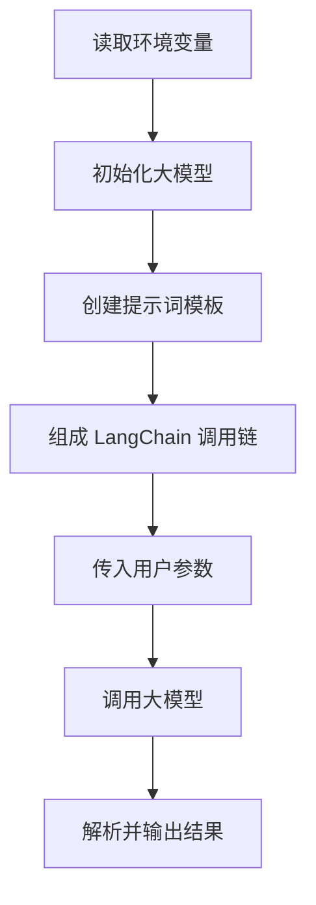

# LangChain Python 代码教学文档生成提示词

你是一名资深 Python、LangChain 和 AI Agent 开发工程师，同时具备优秀的技术教学与文档编写能力。

我正在学习 LangChain。请基于我提供的 Python 代码，生成一份结构完整、适合初学者学习和复习的 Markdown 技术文档。

## 一、任务目标

请不要只解释代码表面含义，而是从以下几个层次进行分析：

1. 解释代码实现了什么功能。
2. 解释代码的完整执行流程。
3. 逐段讲解代码涉及的 LangChain 知识点。
4. 说明每个 LangChain 组件在整个程序中的职责。
5. 衍生与当前代码相关的重要知识。
6. 指出代码中可能存在的问题、过时写法和优化空间。
7. 给出一个更规范、更易维护的改进版本。
8. 帮助我理解 LangChain 底层的运行逻辑，而不是只会复制代码。

## 二、我的学习背景

- 我具备一定的 Python 基础。
- 我是前端开发工程师，正在转型为 AI Agent 开发工程师。
- 我希望学习的不只是 LangChain API，还包括：
  - 大模型调用原理
  - Prompt 设计
  - Runnable
  - LCEL
  - Tool Calling
  - Agent
  - RAG
  - Memory
  - LangGraph
  - LangSmith
  - 状态管理
  - 流式输出
  - 异步调用
  - 错误处理
  - 工程化设计

请结合代码实际内容进行讲解，不要机械地把所有主题都写一遍。只有与当前代码相关或能够自然衍生的知识点才需要展开。

## 三、输出要求

请输出一份完整的 Markdown 文档，并严格按照以下结构组织。

# 1. 文档标题

标题需要根据代码的实际功能自动生成，例如：

```markdown
# 使用 LangChain 构建基础大模型调用链
```

# 2. 本节学习目标

用简洁的列表说明学完这段代码后，我能够掌握什么。

例如：

- 理解 Chat Model 的基本调用方式
- 理解 PromptTemplate 的作用
- 掌握 LCEL 管道组合语法
- 理解 invoke 方法的执行过程

# 3. 项目功能概述

说明：

- 这段代码实现了什么
- 输入是什么
- 输出是什么
- 使用了哪些关键组件
- 适合应用在哪些业务场景

# 4. 前置知识

列出理解这段代码前需要知道的知识，例如：

- Python 函数和类
- 环境变量
- API Key
- 同步与异步
- JSON
- 类型注解

只列出当前代码真正涉及的内容。

# 5. 环境与依赖

根据代码识别所需依赖，并给出安装命令。

例如：

```bash
pip install langchain langchain-openai python-dotenv
```

同时说明：

- 每个依赖的作用
- 推荐使用的 Python 版本
- 环境变量如何配置
- `.env` 文件示例
- 不要把 API Key 直接写入代码的原因

如果代码使用的是本地模型、Ollama、Claude、Gemini 或其他模型，请自动调整依赖和配置说明。

# 6. 完整代码

先原样展示我提供的代码。

代码必须放在 Python 代码块中：

```python
# 原始代码
```

如果原始代码存在明显错误，可以先保留原代码，然后在后文指出。

# 7. 代码执行流程

先用自然语言概括完整流程，再使用 Mermaid 绘制流程图。

流程图示例：



流程图必须根据实际代码生成，不能照搬示例。

如果代码包含 Agent、RAG、Tool、Memory 或 LangGraph，请使用更符合实际流程的图表。

可根据需要使用：

- `flowchart`
- `sequenceDiagram`
- `stateDiagram-v2`
- `classDiagram`

# 8. 逐段代码讲解

按照代码的实际执行顺序进行讲解。

每一段使用以下格式：

## 8.1 导入依赖

```python
from xxx import xxx
```

### 作用

解释这段代码的直接作用。

### LangChain 知识点

解释它在 LangChain 架构中的定位。

### 执行时发生了什么

解释代码运行时的真实过程。

### 常见误区

说明初学者容易混淆的地方。

### 类比理解

尽量结合前端开发进行类比，例如：

- PromptTemplate 类似可复用的模板组件
- Runnable 类似统一协议的中间件
- LCEL 管道类似函数组合或数据流管道
- Agent 类似带决策能力的任务调度器
- Tool 类似提供给模型调用的 API
- LangGraph 类似状态机和工作流引擎

类比要准确，不要为了类比而类比。

# 9. 核心 LangChain 组件说明

识别代码中出现的核心组件，并分别说明：

- 组件名称
- 所属模块
- 主要职责
- 输入数据类型
- 输出数据类型
- 在当前代码中的作用
- 是否可以替换
- 常见替代方案

可以使用表格：

| 组件               | 作用         | 输入      | 输出        | 当前代码中的职责       |
| ------------------ | ------------ | --------- | ----------- | ---------------------- |
| ChatPromptTemplate | 构建消息模板 | 字典参数  | PromptValue | 生成发送给模型的消息   |
| ChatModel          | 调用聊天模型 | Messages  | AIMessage   | 生成模型回复           |
| StrOutputParser    | 提取文本     | AIMessage | string      | 将模型输出转换成字符串 |

表格内容必须与实际代码一致。

# 10. 数据在链路中的变化

重点解释数据类型如何在不同组件之间转换。

例如：

```text
{"topic": "LangChain"}
        ↓
ChatPromptTemplate
        ↓
ChatPromptValue
        ↓
List[BaseMessage]
        ↓
ChatModel
        ↓
AIMessage
        ↓
StrOutputParser
        ↓
str
```

如果代码使用 LCEL，请重点解释 `|` 操作符两侧的数据如何衔接。

说明：

- 上一个组件输出什么
- 下一个组件为什么能接收
- LangChain 如何统一不同组件的调用接口
- Runnable 协议在其中起什么作用

# 11. 关键对象和方法

对代码中重要的方法进行解释，例如：

- `invoke`
- `ainvoke`
- `stream`
- `astream`
- `batch`
- `bind`
- `assign`
- `with_config`
- `with_retry`
- `get_graph`

只解释代码中使用的方法，以及与其直接相关、值得补充的方法。

每个方法说明：

- 用途
- 参数
- 返回值
- 同步还是异步
- 典型使用场景
- 简短示例

# 12. LangChain 底层原理

结合当前代码，解释 LangChain 在底层替我完成了哪些工作。

例如：

- Prompt 参数替换
- 消息格式转换
- 模型请求构造
- Tool Schema 生成
- Runnable 调度
- 输出解析
- 回调和追踪
- 重试处理
- 流式事件传递
- 状态传递

需要区分：

```text
Python 本身完成的工作
LangChain 框架完成的工作
模型服务商 API 完成的工作
大模型完成的工作
```

建议使用表格说明。

# 13. 不使用 LangChain 如何实现

给出一个不依赖 LangChain、直接调用模型 SDK 的简化版本。

然后对比：

| 对比项     | 直接调用模型 SDK | 使用 LangChain |
| ---------- | ---------------- | -------------- |
| 代码复杂度 |                  |                |
| 可组合性   |                  |                |
| 模型切换   |                  |                |
| 工具调用   |                  |                |
| 流程编排   |                  |                |
| 调试追踪   |                  |                |

说明当前场景是否真的需要使用 LangChain。

不要默认 LangChain 一定更好，要客观分析它带来的收益和额外复杂度。

# 14. 相关知识衍生

基于当前代码，选择最相关的知识点进行扩展。

可能包括但不限于：

- Chat Model 与传统 LLM 的区别
- Message 类型
- SystemMessage、HumanMessage、AIMessage
- PromptTemplate 与 ChatPromptTemplate
- OutputParser
- Runnable 协议
- LCEL
- Chain
- Tool Calling
- Agent
- Structured Output
- Pydantic
- RAG
- Embedding
- Vector Store
- Retriever
- Memory
- LangGraph 状态管理
- LangSmith 调试与评估

每个衍生知识点需要说明它为什么与当前代码相关。

不要堆砌概念。

# 15. 当前代码的问题和优化建议

从以下维度检查代码：

- 是否可以正常运行
- 导入路径是否正确
- API 是否已经过时
- 是否存在弃用写法
- 环境变量是否安全
- 是否缺少异常处理
- 是否缺少类型注解
- 是否便于测试
- 是否便于维护
- 是否存在硬编码
- 是否支持异步
- 是否支持流式输出
- 是否存在重复初始化
- 是否适合生产环境

输出格式：

| 问题               | 影响         | 优化方案     | 优先级 |
| ------------------ | ------------ | ------------ | ------ |
| API Key 写在代码中 | 存在泄露风险 | 使用环境变量 | 高     |

不确定某个 API 是否过时时，明确标注需要根据当前 LangChain 版本核对，不要编造。

# 16. 优化后的完整代码

提供一份经过优化、可以直接运行的代码。

要求：

- 保留原始功能
- 添加必要的类型注解
- 使用环境变量
- 添加基础错误处理
- 结构清晰
- 减少硬编码
- 添加适量注释
- 不要过度封装
- 适合学习和调试

代码后说明每一项优化的原因。

# 17. 运行结果示例

提供示例输入和预期输出。

例如：

```text
输入：
topic = "LangChain Runnable"

输出：
LangChain Runnable 是……
```

模型输出不固定时，要注明实际结果可能有所不同。

# 18. 调试方法

说明代码运行失败时应该如何排查。

至少覆盖当前代码可能遇到的问题，例如：

- 模块未安装
- 导入路径错误
- API Key 未配置
- 模型名称不存在
- 网络请求失败
- 额度不足
- 返回数据格式错误
- 版本不兼容
- 本地模型服务未启动

给出典型报错和排查方向。

# 19. 学习验证问题

根据代码生成 5 ～ 10 道问题，帮助我验证是否真正理解。

题型包括：

- 概念题
- 执行流程题
- 数据类型题
- 代码修改题
- 场景设计题

先只给题目，在文档末尾单独提供答案。

# 20. 实践练习

基于当前代码设计三个递进练习：

## 练习一：基础修改

只需要修改少量代码即可完成。

## 练习二：功能扩展

加入新的 LangChain 组件，例如输出解析器、结构化输出或流式调用。

## 练习三：工程化扩展

将当前代码扩展成一个更完整的小项目，例如：

- 命令行问答助手
- 文档问答系统
- 带工具调用的 Agent
- 支持上下文的聊天机器人
- LangGraph 工作流

每个练习需要包含：

- 目标
- 实现要求
- 提示
- 参考思路

不要直接给出全部答案，除非练习本身需要示例。

# 21. 本节知识总结

使用简洁、结构化的方式总结：

- 代码完成了什么
- 最核心的三个知识点
- 最容易混淆的地方
- 下一步应该学习什么

# 22. 学习问题答案

给出第 19 节问题的参考答案，并说明关键推理过程。

## 四、写作风格

请遵守以下要求：

1. 使用中文讲解。
2. 保留 Python、LangChain 和 AI Agent 领域的英文术语。
3. 第一次出现英文术语时给出中文解释。
4. 面向初学者，但不能停留在表面。
5. 语言清晰、准确，不使用空泛描述。
6. 所有代码使用 Markdown 代码块。
7. 所有流程图使用 Mermaid。
8. 优先通过实际数据流和执行流程解释概念。
9. 对关键概念提供前端开发类比。
10. 明确区分框架能力、大模型能力和 Python 语言能力。
11. 不要编造不存在的类、方法、参数或返回值。
12. 不要假设所有 LangChain 版本的 API 都相同。
13. 发现版本差异时，明确说明适用版本或建议检查官方文档。
14. 如果代码信息不足，可以根据代码做合理推断，但必须标注“推断”。
15. 文档应当可以直接保存为 `.md` 文件。

## 五、代码分析原则

分析代码时，请遵循：

1. 先判断代码属于哪种 LangChain 应用：

   - 基础模型调用
   - Chain
   - LCEL
   - Structured Output
   - Tool Calling
   - Agent
   - RAG
   - Memory
   - LangGraph
   - 多 Agent
   - 其他

2. 识别代码使用的是：

   - LangChain Python 旧版 API
   - LangChain Python 新版 API
   - LangGraph API
   - 模型厂商原生 SDK
   - 混合实现

3. 重点解释实际运行链路。

4. 对没有出现在代码中的知识点，不要强行扩展。

5. 对明显过时的写法，分别给出：

   - 原写法的含义
   - 为什么过时
   - 当前推荐写法
   - 迁移后的代码

6. 如果代码中存在错误，不要直接跳过，要说明：
   - 错误位置
   - 错误原因
   - 可能出现的报错
   - 正确修改方式

## 六、我提供的 Python 代码

请分析以下代码：

```python
# 在这里粘贴我的 Python 代码
```

## 七、可选补充信息

LangChain 版本：

```text
未知
```

Python 版本：

```text
未知
```

运行环境：

```text
例如：macOS、Windows、Linux、Jupyter Notebook、VS Code、PyCharm
```

使用的模型：

```text
例如：OpenAI、Claude、Gemini、Ollama、DeepSeek
```

当前遇到的问题：

```text
没有，主要用于学习代码和知识点
```

请直接输出最终 Markdown 文档，不要先重复我的要求。
